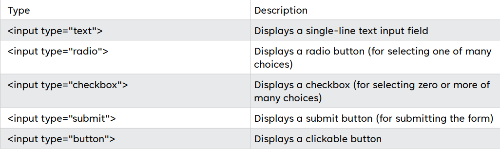

# Web Prog Finals

## 1. MySQLi

### Setup Connection
- Instantiating new instance of MySQLi
```php 
$db = new mysqli('localhost', 'ROOT_USERNAME’,'ROOT_PASSWORD', 'DATABASE');
if($db->connect_errno > 0){
    die('Unable to connect to database [' . $db->connect_error .']');
}
```

### Query
- Example: pull out all of the users from the users table where they have status = ‘active’.

```php
$sql = "SELECT * FROM `users` WHERE `status` = 'active' ";
if(!$result = $db->query($sql)){
    die('There was an error running the query [' . $db->error . ']');
}
```

### Output Query Results
- To loop through the results and output the username for each row on a new line
  - Example:
    ```php
    while($row = $result->fetch_assoc()){
        echo $row['username'] . '<br />';
    }
    ```
    or 
    ```php
    while($row = $result->fetch_object()){
        echo $row->username . '<br />';
    }
    ```

### Number of returned rows
- Each mysqli_result object that is returned has a variable defined which is called ```$num_rows```, so all we need to do is access that variable by doing:

```php
<?php
    echo 'Total results: ' . $result->num_rows;
?>
```

### Number of affected rows
- When running an ```UPDATE``` query you sometimes want to know how many rows have been updated, or deleted if running a ```DELETE``` query, this is a variable which is inside the mysqli object.
  - Example:
```php
<?php
    echo 'Total rows updated: ' . $db->affected_rows;
?>
```

### Free result

- It's advisable to free a result when you've finished playing with the result set, so in the above example we should put the following code after our ```while()``` loop:
  - Example:
```php
    $result->free();
```
- This will free up some system resources, and is a good practice to get in the habit of doing.

### Escaping Characters
- When inserting data into a database, we'll have been to escape it first, so that single quotes get preceded by a backslash.
```php
$db->real_escape_string('This is an unescaped "string"');
```
- However, because this is a commonly used function, there is an alias function that you can use which is shorter andless to type:
```php
$db->escape_string('This is an unescape "string"');
```
- This string should now be safer to insert into your database through a query.


### Close Connection

- Don't forget, when you've finished playing with your database to make sure that you close the connection:

```php
$db->close();
```

### Final Conclusion
- Using ```mysql_``` functions is a foolish move to make.
- *Don't use these outdated and useless methods* because they're easier, or quicker.
- Man up and tackle the new forms of database interaction - ```MySQLi```.
  - You'll make better and secure code


## 2. Bootstrap

https://webtechnologies.site/files/b05/final/presentations/bootstrap-170319142352.pdf

## 3. PHP to sql

https://webtechnologies.site/files/b05/final/presentations/phpTOsql.pdf

## 4. HTML Form

### HTML forms
- An HTML form is used to collect user input. 
- The user input is most often sent to a server for processing.

### The ```<form>``` element
- The HTML ```<form>``` element is used to create an HTML form for user input:

```html
<form>
    .
    form elements
    .
</form>
```

### The ```<input>``` element
- The HTML ```<input>``` element is the most used form element.
- An ```<input>``` element can be displayed in many ways, depending on the type attribute.
- Example



### The ```action``` attribute
- The action attribute defines the action to be performed when the form is submitted. 
- Usually, the form data is sent to a file on the server when the user clicks on the submit button.

```html
<form action="/action_page.php">
    <label for="fname">First name:</label><br>
    <input type="text" id="fname" name="fname" value="John"><br>
    <label for="lname">Last name:</label><br>
    <input type="text" id="lname" name="lname" value="Doe"><br><br>
    <input type="submit" value="Submit">
</form>
```


### The ```method``` attribute
- The method attribute specifies the HTTP method tobe used when submitting the form data.
- The form-data can be sent as URL variables (with ```method="get"```) or as HTTP post transaction (with ```method="post"```).

```html
<form action="/action_page.php" method="get">
```
or
```html
<form action="/action_page.php" method="post">
```

**Notes on GET:**
- Appends the form data to the URL, in name/value pairs
- *NEVER use GET to send sensitive data!* (the submitted form data is
visible in the URL!)
- The length of a URL is limited (2048 characters)
- Useful for form submissions where a user wants to bookmark the result
- GET is good for non-secure data, like query strings in Google

**Notes on POST:**
- Appends the form data inside the body of the HTTP request (the
submitted form data is not shown in the URL)
- POST has no size limitations, and can be used to send large amounts of data.
- Form submissions with POST cannot be bookmarked


# Web Prog Midterms

## 1. MySQLi
https://docs.google.com/document/d/1LY5oa3IKzZyuZhi-XRto0B7FDAjzvUm_RTrNoJu2iBE/edit?usp=sharing

## 2. Javascript
https://webtechnologies.site/javascript.pdf

## 3. PHP
https://webtechnologies.site/PHP.pdf

## 4. CSS Responsive
https://webtechnologies.site/css-responsive.pdf
